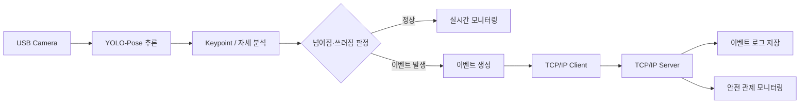

#  넘어짐 감지 안전 관제 시스템

> 카메라 영상에서 YOLO-Pose 기반으로 사람의 자세를 분석해 넘어짐·쓰러짐을 감지하고, 이벤트를 서버로 전달하는 안전 관제 시스템

---

##  프로젝트 목적

카메라 영상에서 사람의 자세를 실시간으로 분석하여  
**넘어짐·쓰러짐 상황을 자동으로 감지하고 서버에서 이벤트를 확인할 수 있는 관제 시스템**을 구현하는 것이 목적입니다.

학습된 AI 모델을 ONNX 형식으로 변환해 C# / .NET 프로그램에서 활용하고,  
감지 결과를 TCP/IP 통신으로 서버에 전달하여 **AI 추론과 Client-Server 구조를 통합**하는 것을 목표로 합니다.

---

##  기술 스택

| 구분 | 기술 | 사용 목적 |
|---|---|---|
| 언어 | C# | Client / Server 프로그램 개발 |
| 플랫폼 | .NET | Windows 응용 프로그램 개발 |
| AI | YOLO-Pose | 사람의 자세 및 Keypoint 추정 |
| 모델 연동 | ONNX | 학습 모델을 C# 환경에서 실행 |
| 통신 | TCP/IP | 감지 이벤트를 Client → Server로 전달 |
| 데이터 | 로그 / 이벤트 저장 | 넘어짐·쓰러짐 발생 이력 관리 |

---

##  시스템 구성

### 구성 흐름

**Camera → YOLO-Pose → 자세 분석 → 넘어짐·쓰러짐 판정 → TCP/IP Client → Server → 이벤트 모니터링**

- **Client**: 카메라 입력, YOLO-Pose 추론, 자세 판정 및 이벤트 생성
- **Server**: Client 연결 관리, 이벤트 수신, 로그 저장 및 관제
- **AI Model**: 학습 모델을 ONNX로 변환하여 C# 프로그램에서 사용

---
